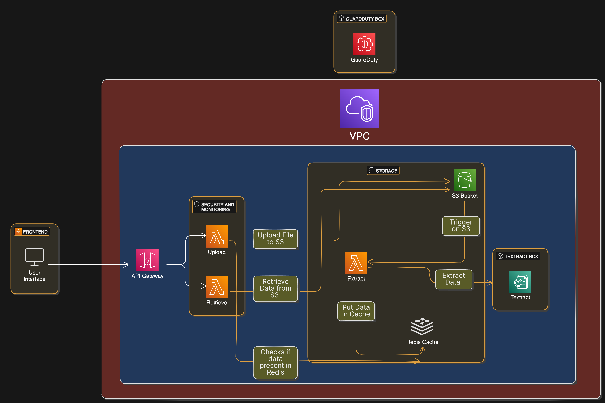
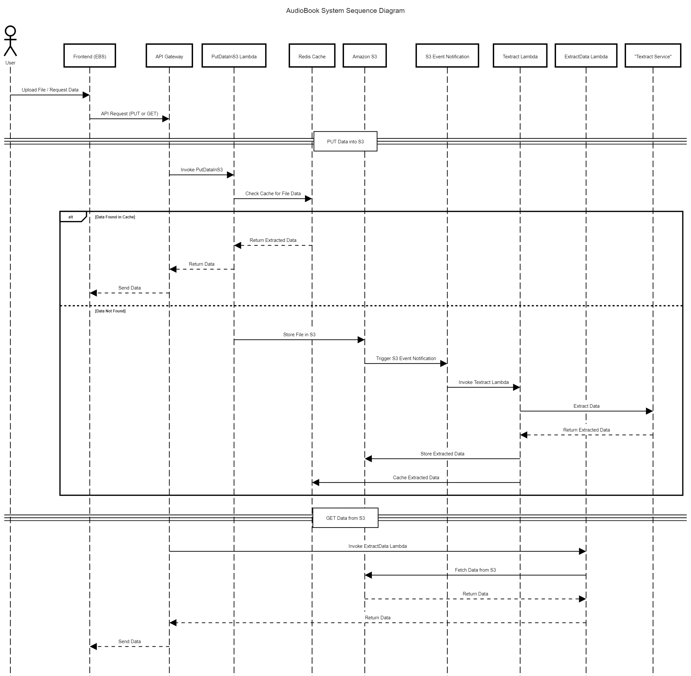

# 🎧 AudioBook Extractor

This project enables users to upload documents (PDF, PNG, JPG, etc.) and extract text from them using Amazon Textract. The extracted content is cached and stored, then converted into audio format for playback—creating an end-to-end **audiobook generator** powered by AWS services.

---

## 📌 Features

- Upload files through a simple frontend hosted on AWS Elastic Beanstalk.
- Serverless architecture using AWS Lambda and S3 event triggers.
- Text extraction from files using Amazon Textract.
- Cached extracted text using Redis (ElastiCache for Redis Serverless).
- Secure infrastructure with AWS VPC and GuardDuty.
- Monitoring and logging with Amazon CloudWatch.
- Fully Infrastructure-as-Code using AWS CloudFormation.

---

## 🏗️ Architecture Overview

### 🧱 System Architecture
 

---

### 🔄 Data Flow Diagram
 

**Main Flow:**
1. User uploads file → API Gateway
2. API Gateway triggers `PutDataInS3` Lambda
3. File is stored in S3 and triggers another Lambda for text extraction
4. Extracted text stored in S3 and cached in Redis
5. Users retrieve the text/audio via another API endpoint

---

## 📋 Technologies & AWS Services Used

| Category | Services |
|---------|----------|
| **Compute** | AWS Lambda, Elastic Beanstalk |
| **Storage** | Amazon S3 |
| **Database/Cache** | Amazon ElastiCache (Redis Serverless) |
| **Networking & API** | Amazon VPC, API Gateway |
| **Security** | AWS GuardDuty |
| **Machine Learning** | Amazon Textract |
| **Monitoring** | CloudWatch |
| **Deployment** | CloudFormation |

---

## 🔧 How It Works

### File Upload
- Files are uploaded via a REST API (API Gateway)
- Checked in Redis for previously extracted content
- If not found, stored in S3 and triggers Textract Lambda

### Text Extraction
- Textract processes the uploaded file
- Extracted text is saved in both Redis (with 1-hour TTL) and S3
- Accessible via another API endpoint for download/playback

---

## 💻 Frontend

The frontend is built using **React** and hosted on AWS Elastic Beanstalk.

### Features:
- File upload interface
- Button to convert and play extracted text
- Integration with backend APIs via API Gateway

---

## ☁️ CloudFormation Setup

Includes IaC for:

- Redis Serverless Cache
- Lambda Functions: Upload, Extract, and Trigger
- API Gateway with CORS-enabled endpoints
- S3 Bucket with event triggers
- Elastic Beanstalk environment for frontend
- GuardDuty Detector for threat monitoring

---

## ✅ AWS Well-Architected Pillars

This project adheres to all 6 pillars:

- **Operational Excellence:** Automated deployments, CloudWatch logging
- **Security:** VPC isolation, GuardDuty, S3 encryption
- **Reliability:** Multi-AZ deployments, retry logic
- **Performance Efficiency:** Caching with Redis, event-driven triggers
- **Cost Optimization:** Serverless, auto-scaling
- **Sustainability:** On-demand infrastructure use with Lambda, API Gateway

---

## 🚀 Getting Started

To deploy this project:

1. Clone the repository
2. Set up your AWS CLI and credentials
3. Deploy CloudFormation stack via AWS Console or `aws cloudformation deploy`
4. Upload the frontend zip to S3 and create a Beanstalk environment
5. Use Postman or your frontend to test the file upload and retrieval

---

## 🧠 Author

**Manish Jadhav**  
Email: mn649712@dal.ca  
Student ID: B00969328

---

## 📜 License

This project is for academic purposes under CSCI5411 - Advanced Cloud Architecting. Licensing terms can be modified if publicly released.

